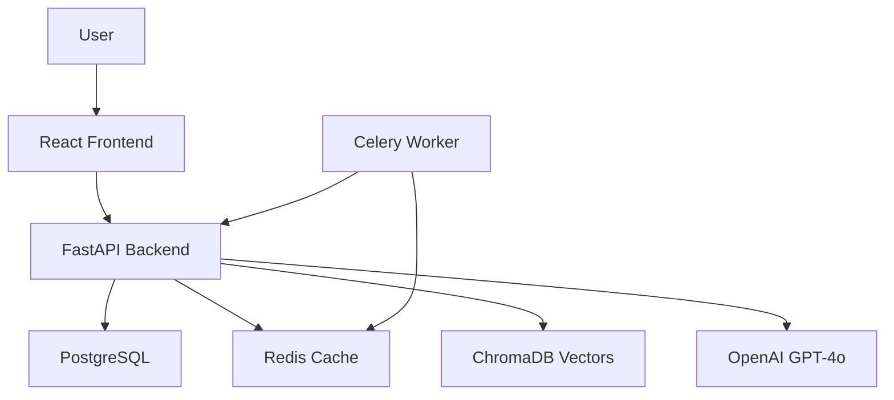
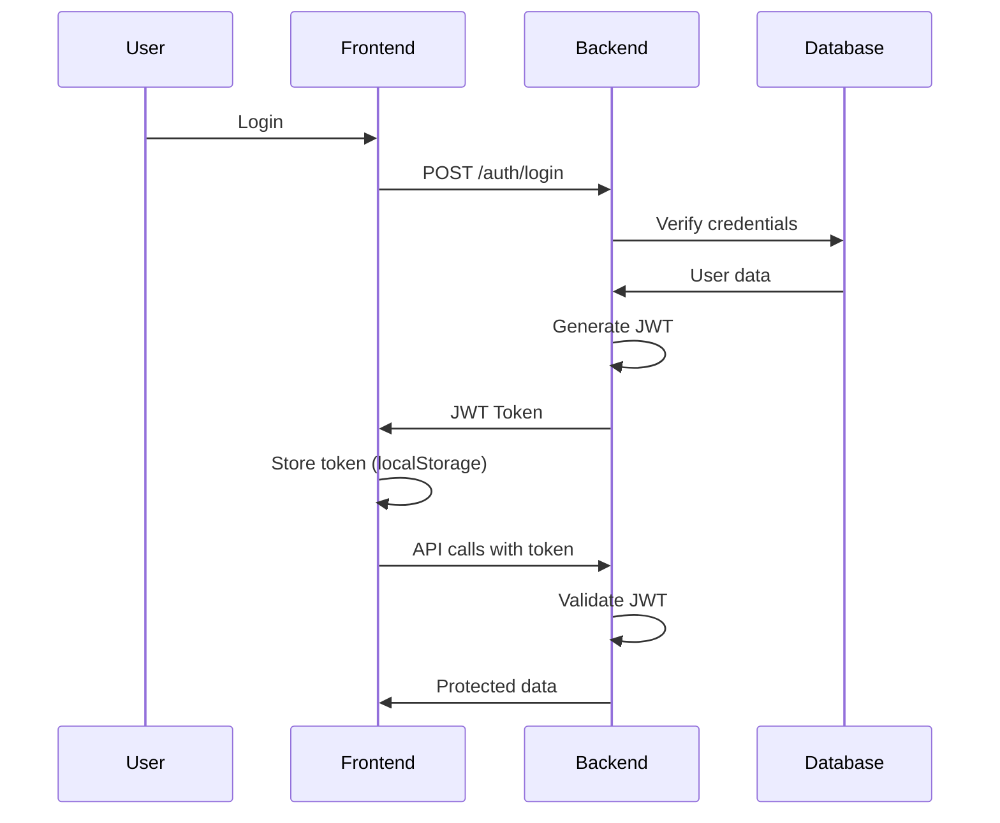

# 🧠 Headhunter AI - Comprehensive Project Presentation

## Enterprise Applicant Tracking System with AI Intelligence

**Version:** 1.11.0  
**Date:** December 2025  
**Prepared By:** Engineering Team

---

## Table of Contents

1. [Executive Summary](#executive-summary)
2. [System Architecture](#system-architecture)
3. [Feature Deep Dive](#features)
4. [Security & Authentication](#security)
5. [CI/CD & Testing Strategy](#cicd)
6. [Roadmap & Future](#roadmap)
7. [Technical Onboarding](#onboarding)
8. [Business Value](#business)

---

## 📋 Executive Summary

### What is Headhunter AI?

**Headhunter AI** is a production-grade, self-hosted Applicant Tracking System engineered for high-performance recruitment teams.

### Key Differentiators

| Traditional ATS | Headhunter AI |
|----------------|---------------|
| Manual data entry | 🤖 AI-powered parsing |
| Basic file storage | 🧠 Semantic search & matching |
| Generic job posts | 🎯 Context-aware descriptions |
| Single-company | 🏢 Multi-tenant architecture |
| Cloud subscription | 💾 Self-hosted, full control |

### Business Value

- **80% reduction** in manual data entry
- **60% faster** candidate screening
- **Complete data ownership** - no vendor lock-in
- **Unlimited users** - no per-seat pricing
- **Enterprise security** - self-hosted on your infrastructure

---

## 🏗️ System Architecture

### High-Level Overview



### Technology Stack

| Layer | Technology | Version | Purpose |
|-------|------------|---------|---------|
| **Frontend** | React | 18 | UI/UX |
| **Styling** | Tailwind CSS | 3.x | Design System |
| **Build Tool** | Vite | 5.x | Fast development |
| **Backend** | FastAPI | 0.111+ | REST API |
| **Runtime** | Python | 3.13 | Application logic |
| **Database** | PostgreSQL | 15 | Relational data |
| **Cache** | Redis | 7 | Caching & queues |
| **Vector DB** | ChromaDB | 0.4+ | Semantic search |
| **AI Engine** | OpenAI | GPT-4o-mini | Parsing & matching |
| **Worker** | Celery | 5.3+ | Background jobs |
| **Deployment** | Docker | Latest | Containerization |

### Project Structure

```
Headhunter/
├── backend/                 # FastAPI Application
│   ├── app/
│   │   ├── api/v1/          # REST Endpoints
│   │   │   ├── auth.py      # Authentication & SSO
│   │   │   ├── cv.py        # CV upload & parsing
│   │   │   ├── jobs.py      # Job management
│   │   │   ├── profiles.py  # Candidate profiles
│   │   │   ├── interviews.py # Interview scheduling
│   │   │   ├── analytics.py # Dashboard metrics
│   │   │   └── sso.py       # SSO providers
│   │   ├── core/            # Config & utilities
│   │   │   ├── database.py  # DB connection
│   │   │   ├── security.py  # JWT & hashing
│   │   │   ├── email.py     # Email service
│   │   │   └── cache.py     # Redis caching
│   │   ├── models/          # SQLAlchemy models
│   │   └── services/        # Business logic
│   │       ├── ai_parser.py # CV parsing
│   │       ├── chroma.py    # Vector search
│   │       └── matcher.py   # Candidate matching
│   ├── alembic/             # Database migrations
│   ├── tests/               # Unit & E2E tests
│   └── scripts/             # Utility scripts
├── frontend/                # React Application
│   ├── src/
│   │   ├── components/      # Reusable UI components
│   │   ├── pages/           # Page-level components
│   │   ├── hooks/           # Custom React hooks
│   │   └── services/        # API client
│   └── cypress/             # E2E tests
├── data/                    # Persistent volumes
│   ├── db/                  # PostgreSQL data
│   └── raw/                 # Uploaded CVs
├── docs/                    # Documentation
└── .github/workflows/       # CI/CD pipelines
```

### Deployment Architecture

```
┌─────────────────────────────────────────────────────────┐
│                    Docker Host                          │
│  ┌──────────────┐  ┌──────────────┐  ┌──────────────┐ │
│  │   Frontend   │  │   Backend    │  │   Celery     │ │
│  │  (Port 30004)│  │  (Port 30001)│  │    Worker    │ │
│  └───────┬──────┘  └───────┬──────┘  └──────┬───────┘ │
│          │                 │                 │         │
│          └────────┬────────┴─────────────────┘         │
│                   │                                     │
│  ┌────────────────┼─────────────────────────┐          │
│  │       Internal Docker Network            │          │
│  │  ┌─────────┐  ┌─────────┐  ┌──────────┐ │          │
│  │  │ Postgres│  │  Redis  │  │ ChromaDB │ │          │
│  │  └─────────┘  └─────────┘  └──────────┘ │          │
│  └──────────────────────────────────────────┘          │
└─────────────────────────────────────────────────────────┘
```

**Port Mapping:**

- `30001` → Backend API
- `30002` → PostgreSQL (dev access)
- `30003` → ChromaDB (AI search)
- `30004` → Frontend UI
- `6380` → Redis (dev access)

---

## ✨ Feature Deep Dive

### 1. 🏢 Multi-Company Support

**Business Value:** One deployment serves unlimited companies with complete data isolation.

**Features:**

- Automatic company creation from email domain
- First user from domain becomes Admin
- Strict logical isolation (ALL queries filtered by `company_id`)
- Super Admin dashboard for cross-company management

**Technical Implementation:**

- Database: `company_id` foreign key on all major tables
- Security: Middleware ensures users only access their company data
- Performance: Indexed `company_id` columns for fast filtering

**Real-World Example:**

```
user@acme.com → Company "Acme Corp" (auto-created)
user@techcorp.io → Company "TechCorp" (separate instance)
```

---

### 2. 🧠 AI-Powered Company Profiling

**Business Value:** 10-minute setup instead of hours of manual data entry.

**16 LinkedIn-Style Fields:**

| Category | Fields |
|----------|--------|
| **Basic** | Name, Tagline, Industry, Founded Year, Size, HQ, Type |
| **About** | Description, Mission, Vision, Culture, Values |
| **Business** | Products/Services, Target Market, Competitive Advantage, Specialties |
| **Social** | LinkedIn, Twitter, Facebook, Logo |

**AI Process:**

1. Enter company website URL
2. AI scrapes multiple pages (home, about, careers)
3. Extracts structured data from JSON-LD and meta tags
4. Generates comprehensive profile in 30 seconds

**Technical Stack:**

- BeautifulSoup for web scraping
- OpenAI GPT-4o-mini for intelligent extraction
- Custom prompts for each field type
- Re-generation with custom instructions

---

### 3. 🚀 Comprehensive Job Descriptions

**Business Value:** Professional job postings in 2 minutes instead of hours.

**11 Detailed Fields:**

- Location, Employment Type, Salary Range
- Responsibilities (AI-generated bullets)
- Required Qualifications
- Preferred Qualifications
- Benefits
- Team Information
- Growth Opportunities
- Application Process
- Remote Policy

**Smart Features:**

- **Context-Aware:** Uses your company's mission and values
- **Regeneration:** Update anytime with new AI content
- **Fine-Tuning:** Add custom instructions ("emphasize remote-first")

**Example Workflow:**

```
1. Type: "Senior DevOps Engineer"
2. AI generates full description using company context
3. Review & edit if needed
4. Publish → Auto-match existing candidates
```

---

### 4. 🔐 Enterprise Security & SSO

**Authentication Methods:**

- ✅ Email/Password (Argon2 hashed)
- ✅ Microsoft Azure AD (OAuth 2.0)
- ✅ Google Workspace (OAuth 2.0)
- ✅ Email Verification
- ✅ Password Reset (time-limited tokens)

**Security Features:**

| Feature | Implementation |
|---------|----------------|
| JWT Auth | HS256, 30-min expiry |
| Password Hashing | Argon2 (memory-hard) |
| RBAC | 5 levels (Super Admin → Interviewer) |
| Multi-Tenancy | Logical isolation via `company_id` |
| Network Isolation | Internal Docker network |
| CORS | Strict origin policies |
| SQL Injection | SQLAlchemy ORM |
| Input Validation | Pydantic schemas |
| File Security | Unique filenames, path sanitization |

**Audit Logging:**

- Every action logged with user, timestamp, IP
- Searchable and exportable for compliance
- Real-time activity feed for admins

---

### 5. 🎯 AI-Powered CV Parsing

**Business Value:** Extract structured data from messy resumes automatically.

**Extracted Fields:**

- Personal: Name, Email, Phone, Address, Links
- Professional: Summary, Skills, Years of Experience
- Work History: Company, Title, Duration, Description
- Education: School, Degree, Year
- Metadata: Current/Expected Salary

**Smart Features:**

- **Hidden Link Detection:** Finds LinkedIn/GitHub in PDF metadata
- **Contact Normalization:** Cleans phone numbers and emails
- **Timeline Grouping:** Groups multiple roles at same company
- **Error Recovery:** Handles poorly formatted resumes

**Processing Flow:**

```
Upload → Celery Queue → AI Parsing → Database → ChromaDB Embedding
```

**Performance:**

- Async processing (doesn't block UI)
- Batch operations (process 50+ CVs)
- Retry logic for failed jobs
- Real-time status updates

---

### 6. 🔍 Semantic AI Search

**Business Value:** Find candidates by meaning, not just keywords.

**Features:**

- Natural language queries: "Find React developers with AWS experience"
- Auto-sync on startup (self-healing)
- Vector embeddings via OpenAI
- ChromaDB for semantic matching

**Technical Architecture:**

```
CV Parsed → OpenAI Embedding → ChromaDB Index
         ↓
Search Query → OpenAI Embedding → Vector Search → Ranked Results
```

**Self-Healing:**

- Detects missing embeddings on startup
- Automatically re-indexes
- Manual bulk re-index available

---

### 7. 🎨 Candidate Pipeline Management

**Business Value:** Visual Kanban workflow for managing candidates.

**Stages:** New → Screening → Interview → Offer → Hired

**Features:**

- Drag-and-drop candidates between stages
- Bulk actions (assign, delete, reprocess)
- Real-time updates across users
- Version-based cache invalidation
- Mobile-responsive (!!)

**Smart Matching:**

- As soon as job created → system scans ALL existing CVs
- Suggests "Silver Medalists" (qualified but not hired)
- Match score based on skills and experience

---

### 8. 🎤 Interview Management

**Business Value:** Complete interview workflow from scheduling to feedback.

**Features:**

- Interview assignment to team members
- Multi-stage tracking (Screening, Technical, Final)
- Detailed feedback with ratings (1-10)
- Interview history timeline
- Rescheduling & reassignment
- No-show tracking
- Email notifications

**Dedicated Interview Mode:**

- Split-screen view (CV left, feedback right)
- Toggle PDF/Parsed view
- Inline scheduling
- Mobile-optimized

**Email Notifications:**

- Auto-send calendar invites
- Interview reminders
- Reschedule notifications
- Async email delivery (doesn't block UI)

---

### 9. 📱 Full Mobile Responsiveness

**Business Value:** Recruit on-the-go from any device.

**Features:**

- Complete feature parity with desktop
- Touch-optimized (44px+ targets)
- Smooth drawer animations
- Hamburger navigation
- Responsive tables and cards
- Mobile-first interview mode

**Technical:** Tailwind CSS breakpoints for responsive design

---

### 10. 📈 Real-Time Analytics

**Business Value:** Data-driven hiring decisions.

**Dashboard Metrics:**

- Active Jobs
- Total Candidates
- Hires This Month
- Silver Medalists (runner-ups)

**Pipeline Insights (per job):**

- Average years of experience
- Average current salary
- Average expected salary
- Candidate distribution by stage

**Department Stats:**

- Headcount by department
- Active jobs per department
- Hiring velocity

---

### 11. ⚡ Background Processing

**Business Value:** UI remains fast even during heavy operations.

**Celery Worker Tasks:**

- CV parsing (AI-heavy)
- Bulk candidate reprocessing
- Email sending
- Vector embedding generation

**Technology:**

- Redis as message broker
- Automatic retries on failure
- Task status tracking
- Real-time progress updates

---

### 12. 🤖 AI Department Generator

**Business Value:** Professional department profiles in seconds.

**Features:**

- One-click AI generation
- Department description
- Technology stack suggestions
- Job templates for common roles
- Context-aware (uses company profile)

**Example:**

```
Department: Engineering
  → AI generates:
    - Description: "Building scalable cloud infrastructure..."
    - Tech Stack: React, Python, Kubernetes, AWS
    - Templates: Senior Engineer, DevOps Lead, etc.
```

---

### 13. 👥 Role-Based Access Control (RBAC)

**Business Value:** Appropriate access for each team member.

**Roles & Permissions:**

| Role | Scope | Key Permissions |
|------|-------|-----------------|
| **Super Admin** | Platform-wide | All companies, all features |
| **Admin** | Company-wide | All jobs, billing, user management |
| **Recruiter** | Company-wide | Create/manage jobs, move candidates, view-only settings |
| **Hiring Manager** | Department only | Manage own department jobs, add interviewers to own dept |
| **Interviewer** | Assigned interviews | Submit feedback, **salary masked** |

**Department Scoping:**

- Hiring Managers only see their department
- Auto-assignment when adding team members
- Cannot access other departments' data

**Salary Masking:**

- Interviewers see "CONFIDENTIAL" instead of salary
- Prevents conflict of interest

---

### 14. 🔄 Resume Processing Features

**Business Value:** Fix AI errors and maintain data quality.

**Resume/Reprocess Button:**

- Visible to: Admin, Recruiter, Hiring Manager
- Triggers: Re-parses ALL pending/failed CVs
- Use case: After uploading bulk CVs, resume interrupted processing

**Edit Mode:**

- Fix AI parsing errors directly in UI
- Toggle on/off per field
- Update name, experience, summary

**Bulk Operations:**

- Select 50+ candidates
- Reprocess all selected
- Delete all selected
- Real-time status updates

---

## 🛡️ Security Architecture

### Authentication Flow



### Multi-Tenancy Security

**Logical Isolation:**

```python
# Every query automatically filtered
candidates = db.query(CV).filter(
    CV.company_id == current_user.company_id
).all()
```

**Middleware Protection:**

- JWT validation on every request
- Company ID extracted from user token
- Automatic filtering applied

**Database Design:**

- `company_id` foreign key on: CVs, Jobs, Applications, Interviews
- Index on `company_id` for performance
- CASCADE delete ensuring no orphaned data

---

### Network Security

```
Internet
   ↓
[Nginx Proxy] (optional)
   ↓
[Docker Network]
   ├─ Frontend (exposed: 30004)
   ├─ Backend (exposed: 30001)
   └─ [Internal Network]--- Postgres, Redis, ChromaDB
```

**Security Layers:**

1. Only Frontend & API exposed to host
2. Database & Redis on internal network
3. CORS prevents unauthorized origins
4. Environment variables for secrets

---

## 🧪 CI/CD & Testing Strategy

### Testing Pyramid

```
    /\
   /E2E\         10% - Full workflows (Cypress)
  /____\
 /Integ.\       20% - API + DB (pytest)
/________\
/  Unit   \      70% - Business logic (pytest + Vitest)
/__________\
```

### Test Coverage (Dec 2025)

| Component | Coverage | Status |
|-----------|----------|--------|
| **Backend** | **76%** | ✅ Healthy |
| **Frontend** | **33%** | ⚠️ Improving |

**Backend:** 100% coverage for Models, Schemas, Auth

### Testing Infrastructure

**Backend Unit Tests:**

- Tool: pytest
- Database: In-memory SQLite
- Fixtures: `authenticated_client` with pre-configured admin
- Isolation: Database reset per test

**Frontend Unit Tests:**

- Tool: Vitest + React Testing Library
- Mocks: API responses
- Focus: Component rendering & interactions

**E2E Tests:**

- Tool: Cypress
- Stack: Full dockerized environment
- Database: Real PostgreSQL with seeded data
- Zero retries needed (reliable with real services)

---

### CI/CD Pipeline

**GitHub Actions Workflows:**

#### 1. Main CI/CD (`cid-cd.yml`)

```yaml
on: [push, pull_request]

jobs:
  test-backend:
    - Setup Python 3.13
    - Install dependencies
    - Lint with Ruff
    - Run pytest (unit tests)
  
  test-frontend:
    - Setup Node 18
    - Install dependencies
    - Lint with ESLint
    - Run Vitest
  
  build-and-push:
    needs: [test-backend, test-frontend]
    - Build Docker images
    - Push to Docker Hub
```

**Quality Gates:**

- ✅ Zero test failures
- ✅ Zero linting errors
- ✅ Successful Docker builds

#### 2. E2E Tests (`e2e-tests.yml`)

```yaml
on: [push to main, PR, manual trigger]

steps:
  1. Start E2E stack (docker-compose.e2e.yml)
  2. Wait for services healthy
  3. Reset database schema
  4. Run Alembic migrations
  5. Seed test data
  6. Execute Cypress tests
  7. Upload artifacts (videos/screenshots)
  8. Cleanup
```

**E2E Stack Features:**

- Isolated environment (separate DB, ports)
- Real services (no mocks)
- Automatic cleanup
- Artifact retention (7 days)

---

### Linting & Code Quality

**Backend (Python):**

- Tool: Ruff (fast Rust-based linter)
- Rules: PEP 8 compliance
- Auto-fix available

**Frontend (JavaScript):**

- Tool: ESLint
- Rules: React best practices
- Hooks: Pre-commit validation

**Command Examples:**

```bash
# Backend
docker compose exec backend ruff check .
docker compose exec backend ruff check . --fix

# Frontend
docker compose exec frontend npm run lint
```

---

### Database Migrations

**Tool:** Alembic

**Workflow:**

1. Create migration: `alembic revision -m "description"`
2. Edit generated file (upgrade/downgrade functions)
3. Apply: `alembic upgrade head`
4. Rollback: `alembic downgrade -1`

**Best Practices:**

- Idempotent migrations (check before alter)
- Descriptive names
- Test both upgrade and downgradeExample migration:

```python
def upgrade():
    # Check if column exists before adding
    conn = op.get_bind()
    inspector = sa.inspect(conn)
    columns = [c['name'] for c in inspector.get_columns('interviews')]
    
    if 'created_at' not in columns:
        op.add_column('interviews', 
            sa.Column('created_at', sa.DateTime(timezone=True)))
```

---

## 🚀 Roadmap & Future Features

### Current: v1.11.0 (Stable)

**Delivered Features:**

- ✅ Multi-company support
- ✅ AI Company Profiling
- ✅ AI Job Generation
- ✅ Microsoft + Google SSO
- ✅ Email Verification & Password Reset
- ✅ Semantic Search (ChromaDB)
- ✅ Interview Management
- ✅ Mobile Responsive
- ✅ Department Management
- ✅ Role-Based Permissions

---

### v2.0 Roadmap (20 weeks)

#### Phase 1: Foundation (Weeks 1-4)

- [ ] ✅ Google Sign-In (COMPLETE)
- [ ] Enhanced Audit Logging
- [ ] Department-scoped RBAC improvements

#### Phase 2: Calendar & Automation (Weeks 5-8)

- [ ] Google Calendar Integration
- [ ] Microsoft Outlook Integration
- [ ] Auto Interview Invitations (with attendee rules)

#### Phase 3: Interview Redesign (Weeks 9-12)

- [ ] Visual timeline UI
- [ ] Structured scorecards
- [ ] 360° feedback view
- [ ] Pipeline-Interview merge (unified Kanban)

#### Phase 4: Intelligence (Weeks 13-16)

- [ ] GraphRAG Knowledge Graph
- [ ] Skills Matrix
- [ ] Visual network exploration (D3.js)
- [ ] Advanced semantic search
- [ ] Role-Skill mapping

#### Phase 5: Admin & Analytics (Weeks 17-20)

- [ ] Advanced Admin Dashboard
- [ ] Real-time activity feed
- [ ] Time-to-hire analytics
- [ ] Custom report builder

---

### Strategic Features Explained

#### Calendar Integration

**Business Impact:** Zero manual scheduling, auto-sync with Google/Outlook

**Features:**

- Two-way sync
- Availability detection
- Auto-invites to interviewer, hiring manager, recruiter
- Reschedule propagation

#### GraphRAG & Skills Matrix

**Business Impact:** Intelligent candidate discovery and skill gap analysis

**Capabilities:**

- Knowledge graph: Candidates ↔ Skills ↔ Projects ↔ Companies
- Visual network exploration
- Semantic queries: "Find React developers with cloud experience"
- Skills matrix comparison (candidate vs. job requirements)

**Example Use Case:**

```
Query: "Find candidates similar to John Smith"
  → Graph algorithm finds:
    - Similar tech stacks
    - Overlapping companies
    - Related project types
```

---

## 🎓 Technical Onboarding

### Development Setup

**Prerequisites:**

- Docker & Docker Compose
- OpenAI API Key
- (Optional) SSO credentials

**Quick Start:**

```bash
# 1. Clone repository
git clone <repo-url>
cd Headhunter

# 2. Configure .env
cp .env.example .env
# Edit .env with your OPENAI_API_KEY

# 3. Launch stack
docker compose up -d --build

# 4. Run migrations
docker compose exec backend alembic upgrade head

# 5. Access
# Frontend: http://localhost:30004
# API Docs: http://localhost:30001/docs
```

---

### Environment Variables

**Required:**

```ini
OPENAI_API_KEY=sk-proj-xxxxx
POSTGRES_USER=user
POSTGRES_PASSWORD=password
DATABASE_URL=postgresql://user:password@db:5432/headhunter_db
```

**Optional SSO:**

```ini
# Microsoft
SSO_CLIENT_ID=xxxxx
SSO_CLIENT_SECRET=xxxxx
SSO_TENANT_ID=xxxxx

# Google
GOOGLE_CLIENT_ID=xxxxx
GOOGLE_CLIENT_SECRET=xxxxx
```

**Optional Email:**

```ini
MAIL_USERNAME=your-email@example.com
MAIL_PASSWORD=app-password
MAIL_SERVER=smtp.gmail.com
MAIL_PORT=587
```

---

### Key Development Commands

**Backend:**

```bash
# Run tests
docker compose exec backend pytest tests/ -v

# Lint
docker compose exec backend ruff check .

# Shell access
docker compose exec backend bash

# View logs
docker compose logs backend -f
```

**Frontend:**

```bash
# Run tests
docker compose exec frontend npm run test

# Lint
docker compose exec frontend npm run lint

# Shell access
docker compose exec frontend sh
```

**Database:**

```bash
# Create migration
docker compose exec backend alembic revision -m "description"

# Apply migrations
docker compose exec backend alembic upgrade head

# Rollback
docker compose exec backend alembic downgrade -1

# Connect to DB
docker compose exec db psql -U user -d headhunter_db
```

---

### Code Organization

**Backend Conventions:**

- `api/v1/` - REST endpoints (grouped by entity)
- `models/` - SQLAlchemy models (database tables)
- `services/` - Business logic (AI, search, etc.)
- `core/` - Infrastructure (DB, auth, email)

**Frontend Conventions:**

- `pages/` - Page-level components
- `components/` - Reusable UI components
- `hooks/` - Custom React hooks
- `services/` - API client functions

**Naming:**

- Python: `snake_case` (files, functions, variables)
- JavaScript: `camelCase` (functions, variables), `PascalCase` (components)
- Database: `snake_case` (tables, columns)

---

### Common Tasks

**Add New Endpoint:**

1. Create Pydantic schemas
2. Add endpoint to `api/v1/`
3. Update API router
4. Write tests
5. Update documentation

**Add Database Table:**

1. Create SQLAlchemy model in `models/models.py`
2. Generate migration: `alembic revision -m "add_table"`
3. Edit migration file
4. Apply: `alembic upgrade head`
5. Update schemas

**Add Frontend Page:**

1. Create component in `pages/`
2. Add route in `App.jsx`
3. Create API service function
4. Add navigation link
5. Style with Tailwind

---

## 💼 Business Value Proposition

### Cost Comparison

| Solution | Annual Cost | Limitations |
|----------|-------------|-------------|
| **Greenhouse** | $6,500 - $18,000 | Per-seat pricing, vendor lock-in |
| **Lever** | $12,000 - $25,000 | Cloud-only, limited customization |
| **Workday** | $50,000+ | Enterprise only, complex setup |
| **Headhunter AI** | **$0 - $1,200** | Open-source, unlimited users |

**Cost Breakdown (Headhunter AI):**

- Software: $0 (self-hosted)
- OpenAI API: ~$50-100/month (varies)
- Infrastructure: $100-1000/month (own servers/cloud)
- **Total:** $1,800 - $13,200/year

### ROI Calculation

**For 50-person company:**

| Metric | Before | After | Savings |
|--------|--------|-------|---------|
| **Time per CV** | 15 min | 2 min | 87% faster |
| **CVs per month** | 200 | 200 | - |
| **Hours saved/month** | - | 43 hrs | ~$2,150/mo @ $50/hr |
| **Annual savings** | - | - | **$25,800/year** |

**Additional Benefits:**

- No vendor lock-in
- Full data ownership
- GDPR/compliance friendly (self-hosted)
- Unlimited customization
- No per-seat fees

---

### Strategic Advantages

**1. Data Ownership**

- All candidate data on your infrastructure
- No third-party data sharing
- Easy GDPR compliance
- Export anytime

**2. Customization**

- Full source code access
- White-label potential
- Custom integrations
- Tailored workflows

**3. Scalability**

- Unlimited users
- Unlimited companies (multi-tenant)
- Horizontal scaling (add more workers)
- No licensing constraints

**4. Security**

- Self-hosted = no cloud exposure
- Air-gapped deployment possible
- Custom authentication
- Audit trails

---

### Target Use Cases

**Best For:**

- Tech-savvy companies with DevOps
- Companies with sensitive data requirements
- High-volume hiring (100+ CVs/month)
- Multi-office/multi-brand organizations
- Cost-conscious startups

**Not Ideal For:**

- Non-technical teams without IT support
- Companies preferring SaaS simplicity
- Very small teams (< 5 hires/year)

---

## 📚 Additional Resources

### Documentation

- README: `/README.md`
- Roadmap: `/docs/wiki/ROADMAP_V2.md`
- Testing Strategy: `/docs/wiki/TESTING_STRATEGY.md`
- Role Permissions: `/docs/wiki/ROLE_PERMISSIONS.md`
- Design System: `/docs/DESIGN_SYSTEM.md`
- Verification: `/docs/VERIFICATION.md`

### API Documentation

- Swagger UI: `http://localhost:30001/docs`
- ReDoc: `http://localhost:30001/redoc`

### Support

- GitHub Issues: For bug reports
- GitHub Discussions: For Q&A
- Team Wiki: Internal knowledge base

---

## 🎯 Key Takeaways

### Technical Excellence

✅ Modern tech stack (React, FastAPI, Docker)  
✅ 76% test coverage backend  
✅ Automated CI/CD pipeline  
✅ Production-ready architecture

### Business Value

✅ 80% reduction in manual work  
✅ $25K+ annual savings  
✅ Complete data ownership  
✅ Unlimited scalability

### Security

✅ Enterprise-grade authentication  
✅ Multi-tenant isolation  
✅ RBAC with 5 role levels  
✅ SOC 2 ready architecture

### Innovation

✅ AI-powered parsing & matching  
✅ Semantic search capabilities  
✅ Context-aware job generation  
✅ Mobile-first design

---

## 🚀 Next Steps

### For Development Team

1. Complete Phase 1 roadmap (RBAC improvements)
2. Begin calendar integration POC
3. Increase frontend test coverage to 60%

### For Business Team

1. Define pricing model (if productizing)
2. Create customer onboarding materials
3. Develop case studies

### For Operations

1. Setup production infrastructure
2. Configure monitoring (Sentry, DataDogConfigure backup strategy
4. Implement disaster recovery

---

**Built with ❤️ by the Headhunter AI Engineering Team**

*This presentation document is markdown-based and can be easily converted to PDF using Pandoc or to PowerPoint using Marp or similar tools.*

---

## Conversion Instructions

### To PDF

```bash
# Using Pandoc
pandoc presentation.md -o presentation.pdf --pdf-engine=xelatex

# Using Marp
marp presentation.md -o presentation.pdf
```

### To PowerPoint

```bash
# Using Pandoc
pandoc presentation.md -o presentation.pptx

# Using Marp
marp presentation.md -o presentation.pptx
```

### To HTML Slides

```bash
# Using Marp
marp presentation.md -o presentation.html --theme default

# Using reveal.js via Pandoc
pandoc presentation.md -t revealjs -s -o presentation.html
```
